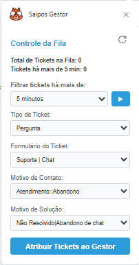

# Saipos Gestor App 

## Descrição 

O **Saipos Gestor App** é um aplicativo desenvolvido para o **Zendesk Support** com o objetivo de auxiliar os gestores no controle da fila de atendimentos da equipe de suporte da **Saipos Software S.A**.

O Zendesk é uma ferramenta robusta, mas apresenta limitações na gestão ágil da fila de atendimentos. Para suprir essa necessidade, este aplicativo foi criado para otimizar esse processo.

## Funcionalidades

- Exibe na **Nav Bar** do Zendesk Support o iframe do app que tem em sua interface o número de **Tickets na fila** e o número de **Tickets com o tempo selecionado no filtro de fila**.
- Permite que o gestor atribua automaticamente a si todos os atendimentos que estão na fila com o tempo em minutos que ele selecionar no filtro e aplicar.
- O app insere automaticamente uma tag que foi definida do ambiente de configuração para ter um controle de relatorio das atuações da supervisão.
- O app também permite configurar uma mensagem de observação interna nos tickets que forem atribuidos ao supervidor para possiveis analises.
- Inclui na sua interface do **iframe** campos onde o gestor pode tabular e classificar os tickets.
- Tem em sua interface também um campo para uma tag opcional para poder melhorar o controlde de retatórios de impactos de incidentes.
- Caso um chat esteja ativo, o gestor pode devolvê-lo à fila. Caso um chat esteja inativo por 10 minutos, o gestor deve encerrá-lo por abandono.

Essa abordagem facilita o controle da fila e melhora a eficiência do atendimento ao cliente.

## Interface



## Tecnologias Utilizadas

 


[](https://code.visualstudio.com/)


## Estrutura do Projeto

A estrutura do aplicativo segue o padrão do framework Zendesk 2.0:

```
/
├── manifest.json
├── /assets
│   ├── iframe.html
│   ├── main.js
│   ├── styles.css
│   ├── reload-icon.svg
│   ├── logo.png
│   ├── logo-small.png
│   ├── icon_top_bar.svg
├── /translations
│   ├── en.json
│   ├── pt-BR.json
```

## Instalação

Para instalar o **Saipos Gestor App** no Zendesk Support:

1. Certifique-se de que todos os arquivos e pastas mencionados acima estão organizados corretamente.
2. Compacte todos os arquivos e pastas na raiz do projeto em um arquivo `.zip`.
3. No Zendesk Support, acesse **Admin Center** > **Aplicativos e integrações** > **Aplicativos do Zendesk Support**.
4. Clique em **Carregar aplicativo privado**.
5. Envie o arquivo `.zip` e siga as instruções na tela para configura-lo.
6. Configure a utilização conforme o modelo de configuração: 
7. No campo Tags das configurações pode se usar mais de uma tag é so separalas com um espaço e quando a tag possuir duas palavras separalas com underline 
Exemplo:[saipos_gestor fila teste]  Neste caso seriam inseridas no ticket três tags uma de saipos_gestor fila e teste.

## Uso

- O aplicativo estará visível na **Nav Bar** do Zendesk Support.

- Para visualizar as informações da fila, basta clicar no ícone do app.
- Utilize o botão **"Atribuir ao Gestor"** para puxar os atendimentos com mais de 10 minutos na fila.

## Versão


## Autores

[@JonathanSilva](https://www.github.com/jnttfreitas) 


## Contribuição

Este aplicativo foi desenvolvido por iniciativa própria para otimizar o fluxo de atendimento na equipe de suporte da **Saipos Software**. Contribuições e sugestões de melhoria são bem-vindas!

